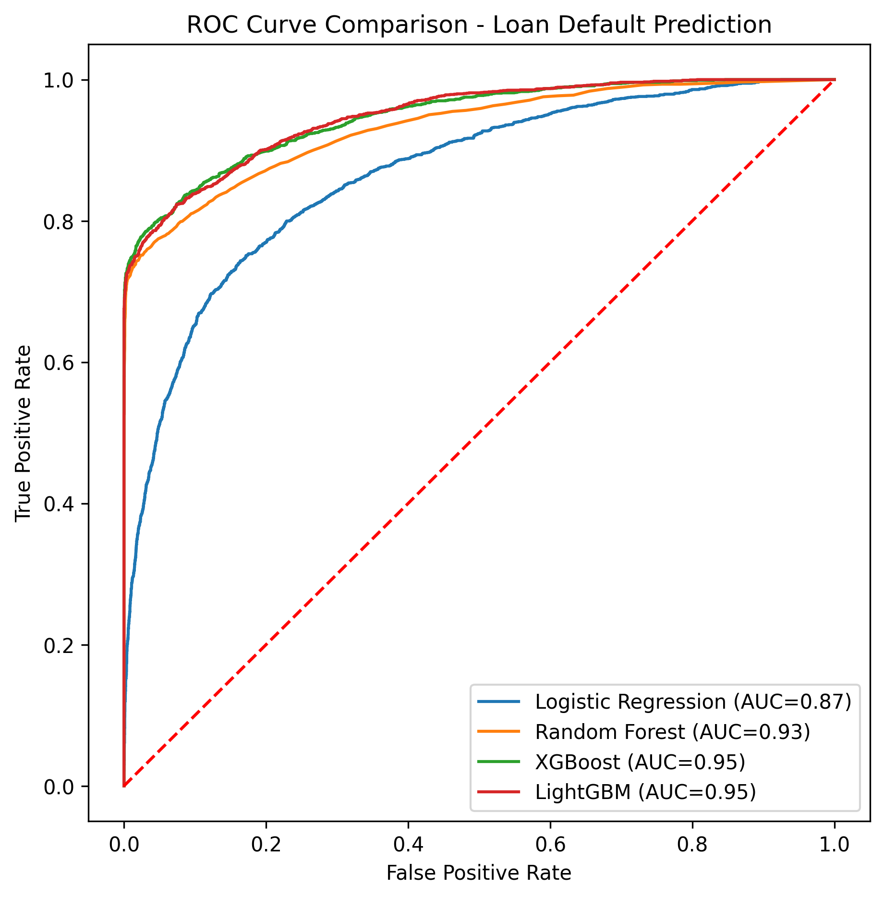
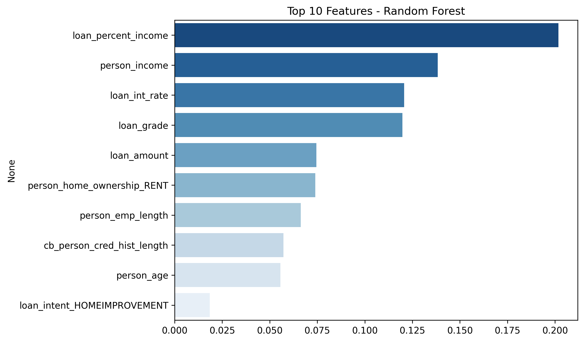
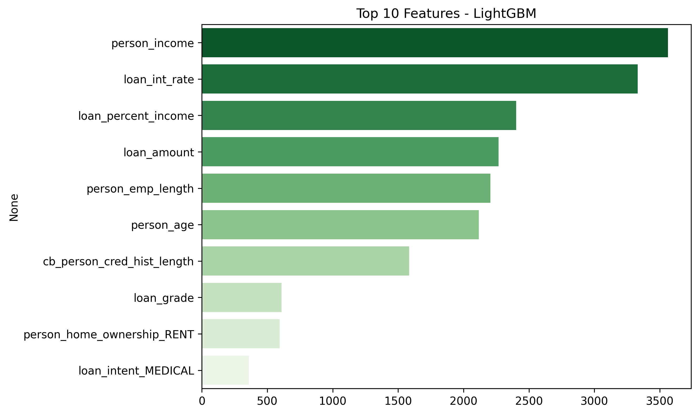
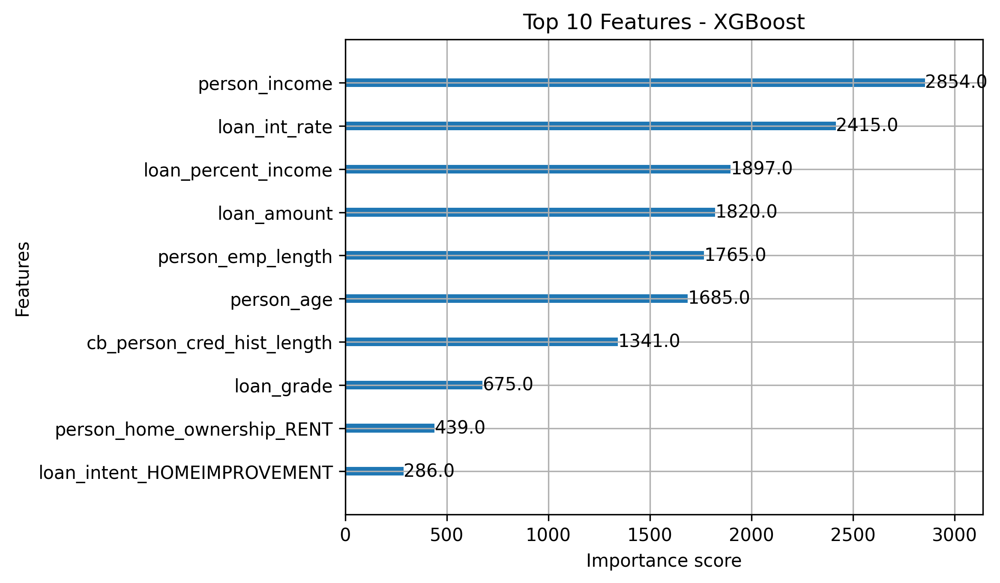

# Credit Risk Scoring & Loan Default Predictor

## Dataset
- The dataset used in this project is included in the repository under '/data/credit_risk_dataset.csv'.
- Source: [Kaggle Credit Risk Dataset](https://www.kaggle.com/datasets/laotse/credit-risk-dataset/data)

## Dataset Overview
- Loan dataset with **32K+ records** and **17 features**
- Target variable: 'loan_status' (0 = Non-Default, 1 = Default)
- Includes borrower loan amount, interest rate, and repayment history

## Data Preprocessing
- Handled missing values and categorical encoding
- Normalized numerical features for model stability
- Split into **Train (22,806 records)** and **Test (9,775 records)** sets

## Model Training
Implemented and compared multiple ML algorithms:
- Logistic Regression
- Random Forest
- XGBoost
- LightGBM

## Model Evaluation
- Compared models using **ROC Curve** and **ROC-AUC scores**
- Generated classification metrics: Accuracy, Precision, Recall, F1-score
- Best performing model: **LightGBM** (ROC-AUC ≈ XX)

### Highlights
- Ensemble methods (XGBoost, LightGBM) outperformed baseline Logistic Regression  
- **LightGBM achieved the highest ROC-AUC**, showing strong predictive power  
- Key predictors of loan default: **Loan Amount, Interest Rate, Income**

### ROC Curve Comparison

### Feature Importance - Random Forest

### Feature Importance - LightGBM

### Feature Importance - XGBoost

## Feature Importance Analysis
- Identified top predictors of loan default:
  - Loan Amount
  - Interest Rate
  - Income
- Visualized feature importance for Random Forest, XGBoost, and LightGBM

## Conclusion & Key Insights
- Ensemble methods (XGBoost, LightGBM) outperformed baseline Logistic Regression
- Loan amount and interest rate are strong indicators of default risk
- Provides actionable insights for financial institutions to improve credit risk scoring

## How to Run
1. Clone this repository:
   '''bash
   git clone https://github.com/Tanuj32-code/Credit-Risk-Scoring-Loan-Default-Predictor.git

